### 数据仓库概念

#### DW：数据仓库

面向主题、集成、稳定、反映历史变化

#### ODS：操作型数据库

早期数仓模型,相对实时

##### ODS vs DW

1. ODS比DW更新频率高。
2. ODS贴原型，与原系统字段相差不大，DW更多的是在维度上进行建模。
3. ODS近实时，更多用来对时效性要求高的运营，DW可以用来分析某一较长时间段内的运营情况。
4. ODS存储的历史数据时间没有DW长，DW理论上包含所有历史数据。
5. ODS基于战术，DW基于战略。

#### STAGING AREA ：分段存储区

为保证数据移动的顺利进行而开设的阶段性数据存储空间。是业务系统原始数据进入数据仓库前的缓存区。

#### DATA MART：数据集市

是DW的子集。部门数据、主题数据。

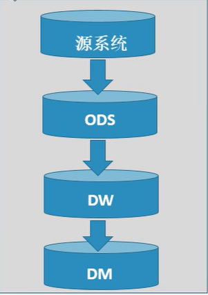

#### OLAP：在线分析系统

按照数据存储格式分为：

关系OLAP(ROLAP、RelationalOLAP)：将分析要用的多维数据存储在关系数据库中，并根据应用的需要有选择的定义一批视图也存储在关系数据库中。

多维OLAP(MOLAP、MultidimensionalOLAP)：将分析要用到的多维数据物理上存储为多位数组的形式，形成“立方体”结构。

混合型OLAP(HOLAP、HybridOLAP)：把ROLAP和MOLAP的优点有机的结合起来，能满足用户各种复杂的分析请求。

#### OLTP：在线交易系统

##### OLAP vs OLTP

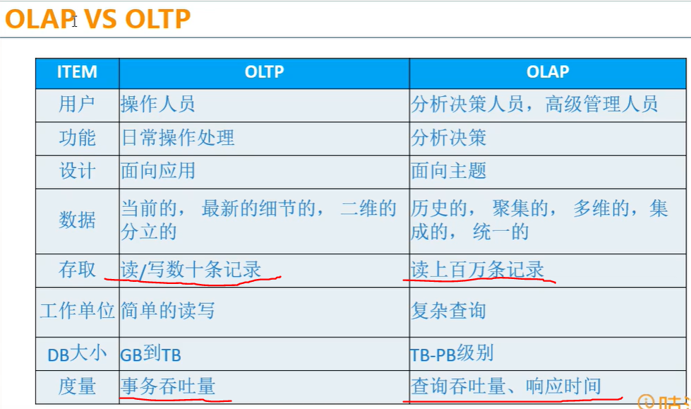

### 数据仓库建模

#### 数据建模方式

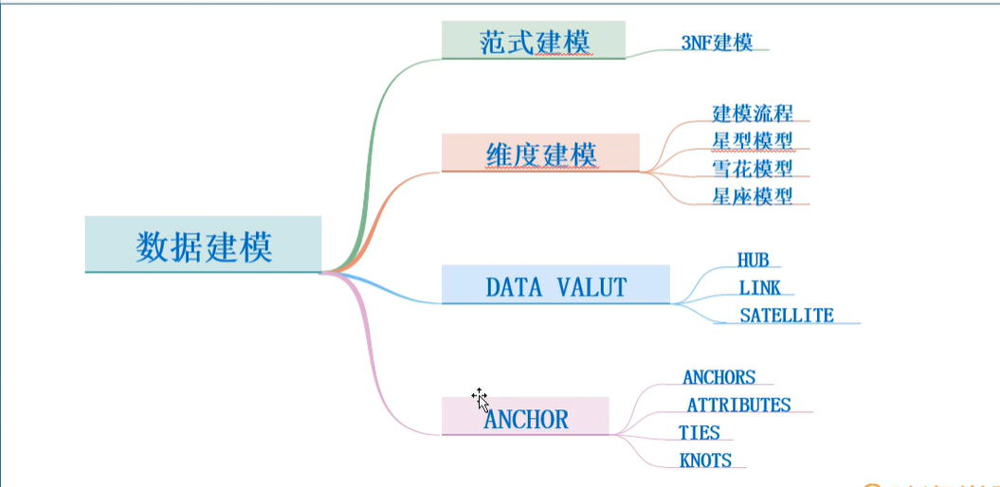

#### 范式建模

与数据库建模三范式一样：

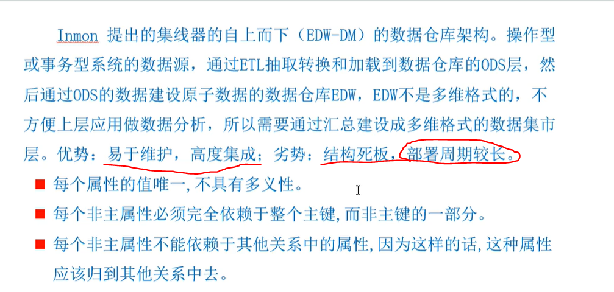

互联网行业使用较少，原因是耗时过长。

#### 维度建模

主要优势在于方便快捷，方便维护。

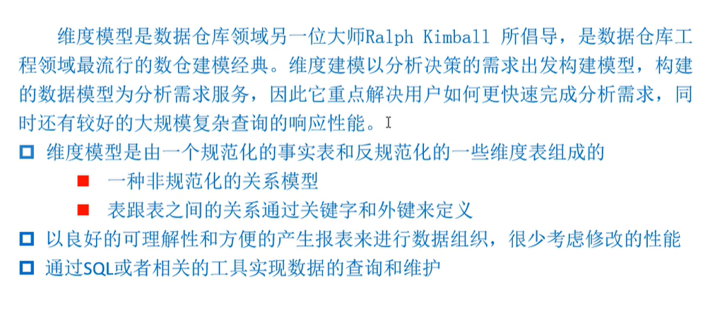

##### 维度表

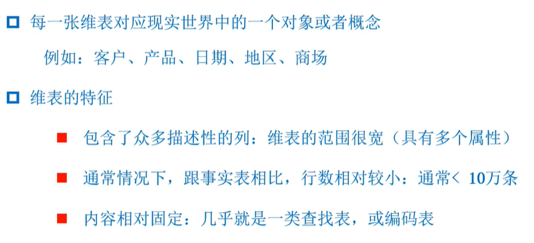

##### 事实表

维度表的主键通常为事实表的外键。

##### 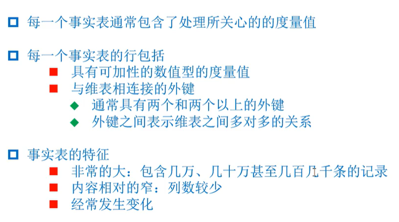维度模型之设计过程

##### 维度模型之星型模型

事实表在中间，被维度表包围。

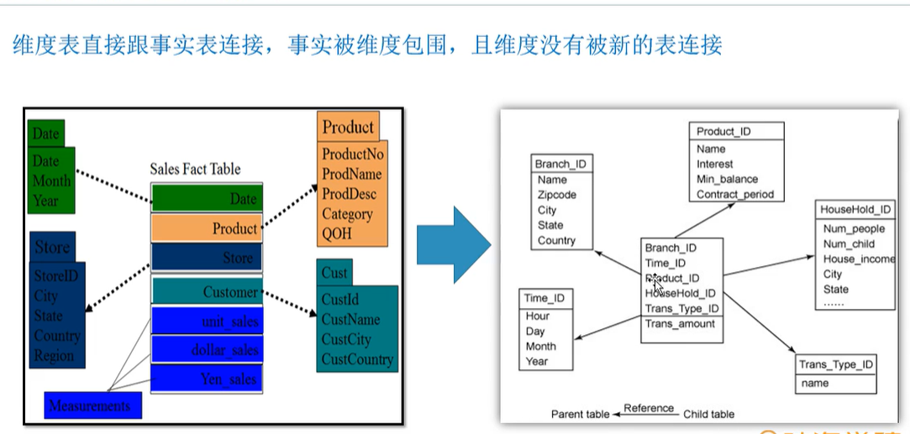

##### 维度模型之雪花模型

每个维度表里边可以分出来更详细的维度

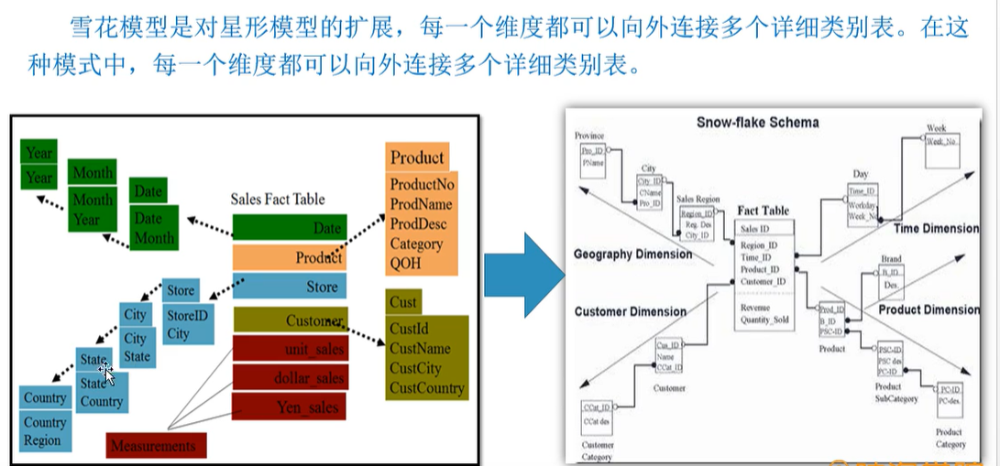

### 数据治理

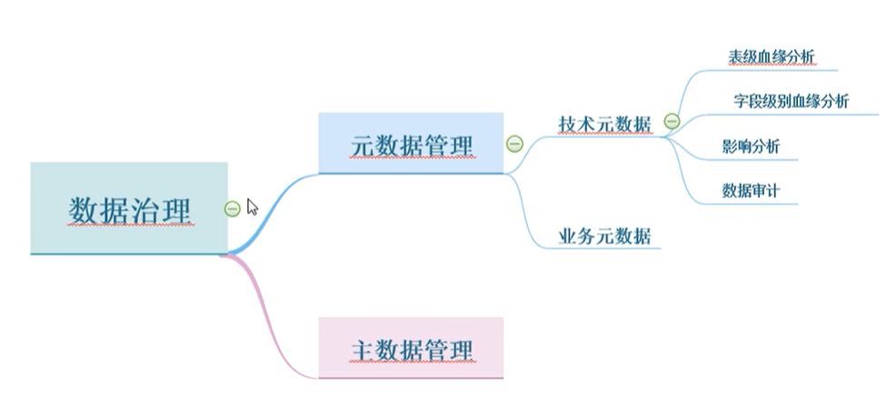

#### 元数据

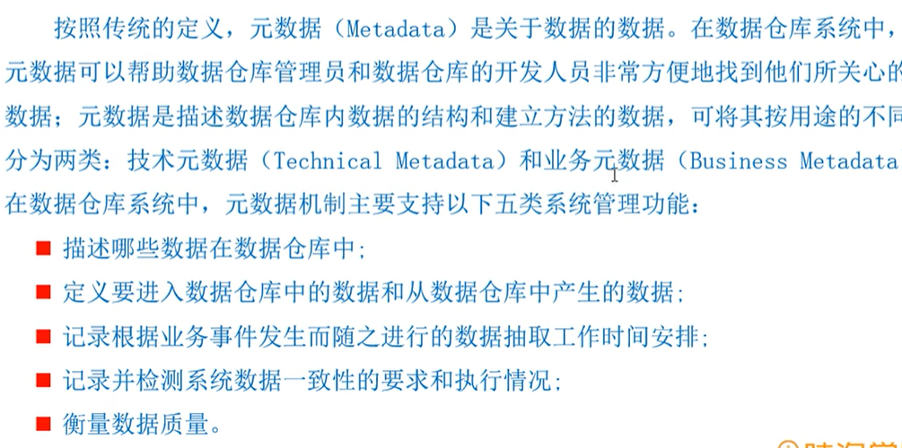

##### 技术元数据

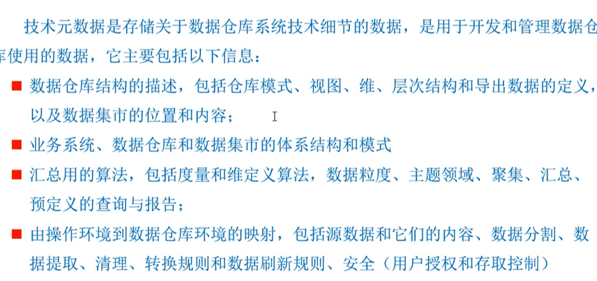

##### 业务元数据

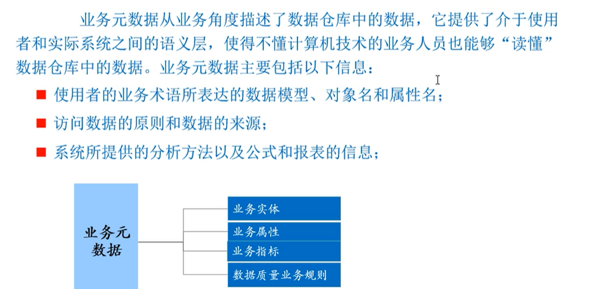

##### 元数据管理

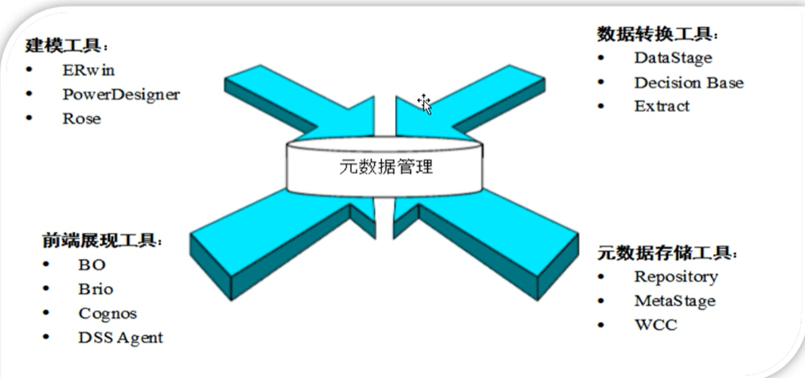

#### 主数据

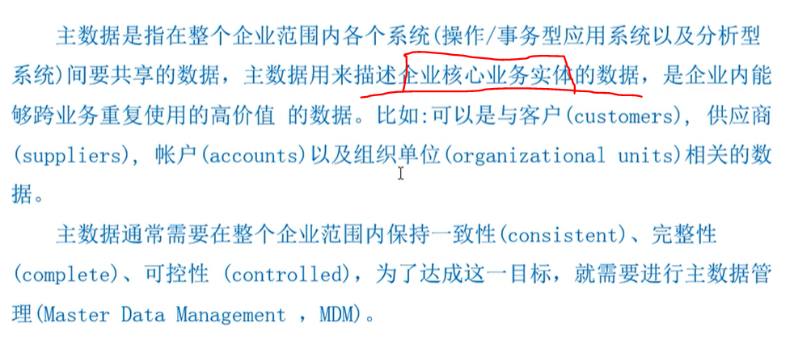

##### 主数据管理

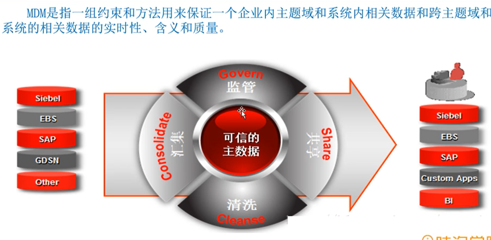

### 数据仓库架构

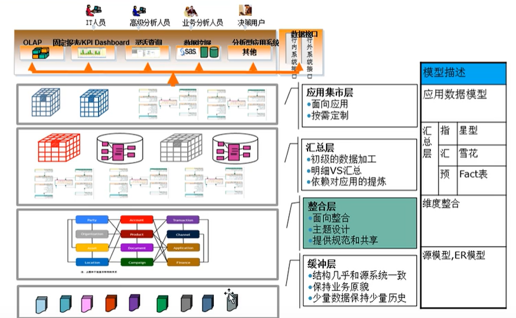

传统公司主要是用关系型数据库进行架构，互联网行业则更多的是用HADOOP。