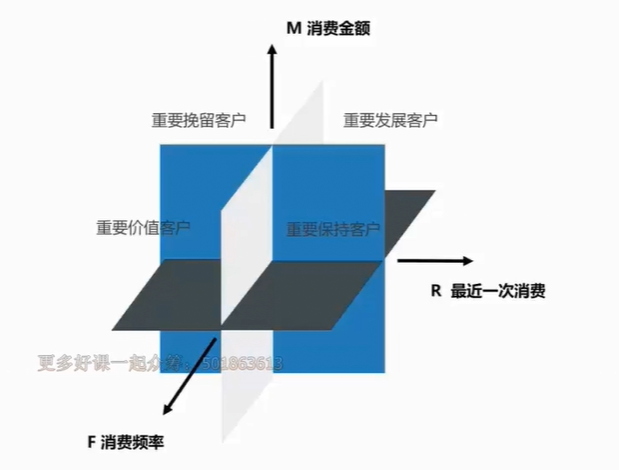

### 三种核心思维

#### 结构化

##### 可能出现的问题

##### 金字塔思维

###### 概念

###### 原则

##### *方法*

1. 可使用思维导图（适合单兵作战）去建立
2. 群体作战，如会议等可使用下图方法：

##### 例子

销量下降：秦路，b站，004

##### *结构化并不完美，需要其他两种思维进行补充*
#### 公式化

核心是把一切东西量化

##### *使用公式化将结构化做出的xmind进行修改，均修改为量化之后的指标。*

##### 例子

销量下降：秦路，b站，005

#### 业务化

#### 思维关系

### 七种思维技巧

#### 象限法

RFM象限，8个维度

##### 概念

#### 多维法

需注意

##### 辛普森悖论

通俗点讲比如人均GDP，被平均或者其他方式给掩盖了真实现象。

###### 避免方法：钻取

##### 概念

#### 假设法

没有数据时使用，如在节日时进行了一次营销活动，但是数据为收集到，此时要求预测带地市活动有效，还是节日导致的。

##### 概念

#### 指数法

把某个数据多个指标按一定的计算转化为同度量的一个值，这个度量值称为指数。

##### 三种函数

线性加权

反比例

LOG

##### 概念

#### 二八法

又叫帕累托法。

##### 概念

#### 对比法

孤数不证

##### 概念

#### 漏斗法

转换率可用到

##### 概念

