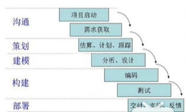
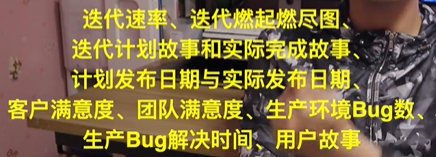
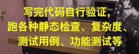

### 传统开发模式：瀑布式开发

需求

设计

编码

测试

提交产品

不太合适，如需求经常修改

### 敏捷开发：一种开发模式

##### 敏捷，强调适应性，增量开发，总分支代码随时可交付

#### 人员架构划分

部门

项目组

团队（八九个人）

#### 团队中分为四个角色

PO（product owner）：如项目经理

SM（scrum master）：敏捷专家,如科长

team：分为DEV（开发人员）

​                    QA（测试人员）

#### 敏捷开发相关的四个会议

##### 敏捷计划会

一个迭代开一次（一般为一个月，月初）

目的：任务明确、需求分析、故事点划分

##### 每日立会

一天一次

目的：任务展板，

##### 敏捷评审会

目的：向客户等利益相关人员展示团队本段时间内的工作，并获取客户的反馈

##### 敏捷回顾会

一月一次，月末

目的：总结经验教训（一小时之内，全部人员都参加）

包括两部分：

1. 定量分析

   

   

2. 定性分析

   比较主观化，保持优点，弥补缺点

#### 写代码怎么样？任务如何完成？

立会上领取故事点

写代码

验证，如

git push，触发CI（持续集成）流程，即代码质量的防护墙

若CI通过，则经过骨干人员进行代码评审

若代码评审通过，则可以入库